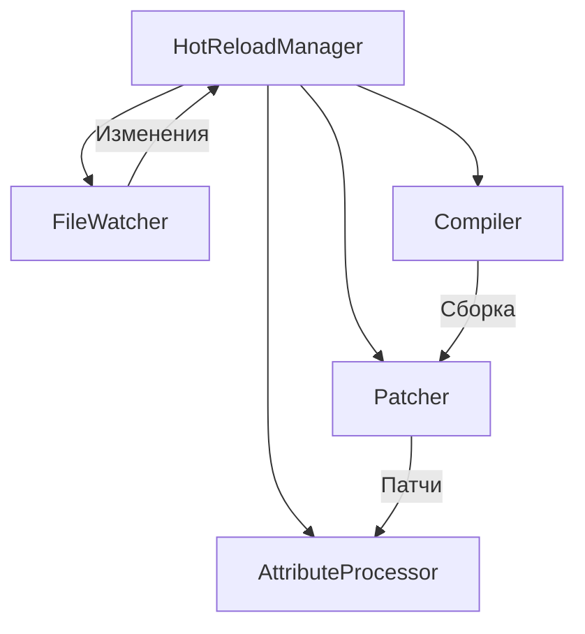

# План архитектуры плагина Hot Reload для Unity

## Обзор
Плагин предоставляет аналог инструмента hot reload для Unity, позволяя изменять код скриптов во время выполнения без полной перекомпиляции проекта. Поддерживает мониторинг изменений, компиляцию и применение патчей к методам.

## Основные функции
- Мониторинг изменений в файлах скриптов C#.
- Динамическая компиляция измененного кода с помощью Roslyn.
- Применение патчей к методам с помощью Harmony.
- Поддержка атрибутов `InvokeOnHotReload` и `InvokeOnHotReloadLocal` для вызова методов при reload.

## Архитектура компонентов

### 1. HotReloadManager
Центральный менеджер, координирующий все компоненты.
- Инициализируется при загрузке Unity Editor.
- Управляет жизненным циклом FileWatcher, Compiler и Patcher.
- Обрабатывает события изменений и запускает процесс reload.

### 2. FileWatcher
Компонент для мониторинга изменений файлов.
- Использует `FileSystemWatcher` для отслеживания изменений в папках скриптов.
- Фильтрует изменения по расширениям (.cs).
- Уведомляет HotReloadManager о изменениях.

### 3. Compiler
Компонент для компиляции кода.
- Использует Roslyn (Microsoft.CodeAnalysis) для компиляции C# кода.
- Создает динамическую сборку из измененных файлов.
- Ссылается на необходимые Unity assemblies (UnityEngine, etc.).

### 4. Patcher
Компонент для применения патчей.
- Использует Harmony для runtime patching методов.
- Заменяет старые методы новыми из скомпилированной сборки.
- Обрабатывает атрибуты для вызова специальных методов.

### 5. AttributeProcessor
Компонент для обработки атрибутов.
- Сканирует сборки на наличие атрибутов `InvokeOnHotReload` и `InvokeOnHotReloadLocal`.
- Вызывает отмеченные методы после применения патчей.

## Зависимости
- **Microsoft.CodeAnalysis.CSharp**: Для компиляции C# кода.
- **0Harmony (Lib.Harmony)**: Для runtime patching.
- **System.IO.FileSystem.Watcher**: Для мониторинга файлов (включено в .NET).

## Структура проекта
```
Assets/HotReloadPlugin/
├── Editor/
│   ├── HotReloadManager.cs
│   ├── FileWatcher.cs
│   ├── Compiler.cs
│   └── AttributeProcessor.cs
├── Runtime/
│   ├── Patcher.cs
│   └── Attributes.cs
└── Plugins/
    ├── Microsoft.CodeAnalysis.dll
    └── 0Harmony.dll
```

## Mermaid диаграмма архитектуры


## Порядок реализации
1. Создать базовую структуру проекта.
2. Реализовать FileWatcher.
3. Реализовать Compiler.
4. Реализовать Patcher.
5. Добавить AttributeProcessor.
6. Тестировать интеграцию.

## Риски и ограничения
- Требует осторожного использования, так как patching может привести к нестабильности.
- Не поддерживает изменения в структурах данных или добавление новых полей.
- Работает только в Editor, не в билдах.